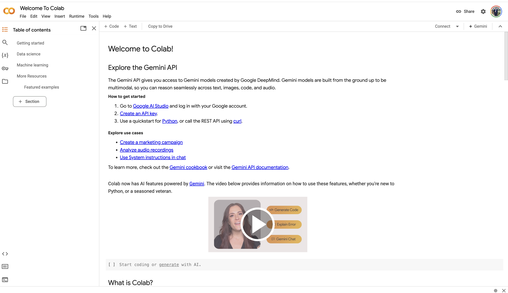

```{r setup, include=FALSE}
knitr::opts_chunk$set(echo = TRUE, warning = FALSE, message = FALSE)
```

# Introduction to Google Colab

Welcome to CLTR6501! This guide will introduce you to Google Colab, the platform we'll be using for our R coding exercises and data analysis tasks.

## What is Google Colab?

Google Colab (short for Colaboratory) is a free, cloud-based platform that allows you to write and execute Python and R code through your browser. It's an excellent tool for data analysis, machine learning, and statistical computing, offering several advantages:

- No local installation required
- Free access to GPUs and TPUs for computationally intensive tasks
- Easy sharing and collaboration features
- Integration with Google Drive for storage

## Why Use Google Colab for CLTR6501?

1. **Accessibility**: Access your work from any device with an internet connection.
2. **Consistency**: Everyone uses the same environment, reducing "it works on my machine" issues.
3. **Computational Power**: Access to more powerful hardware than most personal computers.
4. **Collaboration**: Easily share your work with instructors and peers.

# Getting Started with Google Colab

## Step 1: Sign Up / Log In

1. Go to [Google Colab](https://colab.research.google.com)
2. If you have a Google account, click "Sign In" in the upper right corner. 
3. If you don't have a Google account, create one at [accounts.google.com](https://accounts.google.com)

## Step 2: Create a New Notebook

1. On the Colab homepage, click on "New Notebook" or go to File > New Notebook.
2. A new untitled notebook will open.

## Step 3: Set Up R Environment

By default, Colab uses Python. We need to switch to R:

1. Go to Runtime > Change runtime type
2. In the pop-up window, select "R" from the dropdown menu
3. Click "Save"

## Step 4: Understanding the Colab Interface



- **Menu Bar**: Contains options for file management, editing, runtime control, and help.
- **Toolbar**: Quick access to common actions like adding code/text cells and running all cells.
- **Code/Text Cells**: Where you write your code or explanatory text.
- **Output Area**: Displays the results of your code execution.

### Key Components:
- The play button (▶️) on the left of a code cell runs that cell.
- The "+ Code" and "+ Text" buttons at the top add new code or text cells.
- Use the File menu to save your work or create new notebooks.

# Working with R in Colab

## Running R Code

Let's start with a simple example:

```{r}
print("Welcome to CLTR6501!")
```

To run this code in Colab:
1. Type the code into a code cell.
2. Click the play button or press Shift+Enter.

## Installing and Loading Packages

In Colab, you need to install packages before using them. Here's how:

```{r, eval=FALSE}
install.packages("ggplot2")
library(ggplot2)
```

**Note**: You only need to install a package once per session. After that, you can just load it with `library()`.

## Creating Visualizations

Let's create a simple plot using ggplot2:

```{r}
library(ggplot2)
data <- data.frame(x = 1:10, y = 1:10)
ggplot(data, aes(x, y)) + 
  geom_point() +
  theme_minimal() +
  labs(title = "Simple Scatter Plot", x = "X-axis", y = "Y-axis")
```

## Saving Your Work

- Colab auto-saves your work to Google Drive.
- To save a copy or rename, go to File > Save a copy in Drive.

## Sharing Your Notebook

1. Click the "Share" button in the top right corner.
2. Adjust sharing settings as needed (e.g., anyone with the link can view).
3. Copy the link to share with others or submit your work.

# Advanced Colab Features

## Using Markdown for Explanations

Colab supports Markdown in text cells for formatting:

# Heading 1
## Heading 2
### Heading 3

- Bullet point 1
- Bullet point 2

1. Numbered item 1
2. Numbered item 2

*Italic* and **bold** text

[Link to Google](https://www.google.com)

## Uploading and Accessing Data

You can upload data files directly to Colab:

1. Click the folder icon on the left sidebar.
2. Drag and drop files or use the upload button.

To read an uploaded CSV file:

```{r, eval=FALSE}
data <- read.csv("your_file.csv")
head(data)
```

## Using Google Drive

You can also access files from your Google Drive:

```{r, eval=FALSE}
library(googledrive)
drive_auth()
data <- read.csv(drive_download("your_file.csv")$local_path)
```

# Tips for Effective Colab Use

1. **Reconnect if Inactive**: Colab may disconnect after periods of inactivity. Click "Reconnect" if this happens.
2. **Use Markdown for Notes**: Utilize text cells with Markdown for clear, formatted notes and explanations.
3. **Restart Runtime**: If you encounter issues, try Runtime > Restart runtime.
4. **Organize Your Notebooks**: Use clear naming conventions and folder structures in your Google Drive.
5. **Version Control**: Make copies of important notebooks before making significant changes.

# Troubleshooting Common Issues

1. **Package Installation Fails**: 
   - Try restarting the runtime and installing again.
   - Check for typos in package names.

2. **Code Runs Slowly**: 
   - Use Runtime > Change runtime type to access more powerful hardware.

3. **Notebook Won't Load**: 
   - Clear your browser cache or try a different browser.

4. **Can't Access Shared Notebook**: 
   - Ensure you're logged into the correct Google account.

# Getting Help

- Use the Help menu in Colab for official documentation.
- Check our course forum for CLTR6501-specific questions.
- Attend office hours for personalized assistance.
- Explore [Stack Overflow](https://stackoverflow.com/questions/tagged/google-colaboratory) for community support.

# Conclusion

Google Colab is a powerful tool that will enhance your learning experience in CLTR6501. By following this guide, you should be well-prepared to start using Colab for our course exercises and projects. Remember, practice makes perfect – the more you use Colab, the more comfortable you'll become with its features and capabilities.

Happy coding, and welcome to CLTR6501!

```{r, echo=FALSE}
# You can include a simple interactive element here
library(knitr)
library(kableExtra)

data <- data.frame(
  Feature = c("Code Execution", "Package Installation", "Data Visualization", "Markdown Support", "Google Drive Integration"),
  `Proficiency Level` = c("Beginner", "Intermediate", "Intermediate", "Beginner", "Advanced")
)

kable(data) %>%
  kable_styling(bootstrap_options = c("striped", "hover", "condensed", "responsive"))
```